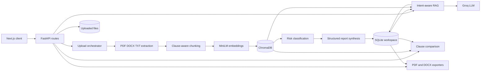
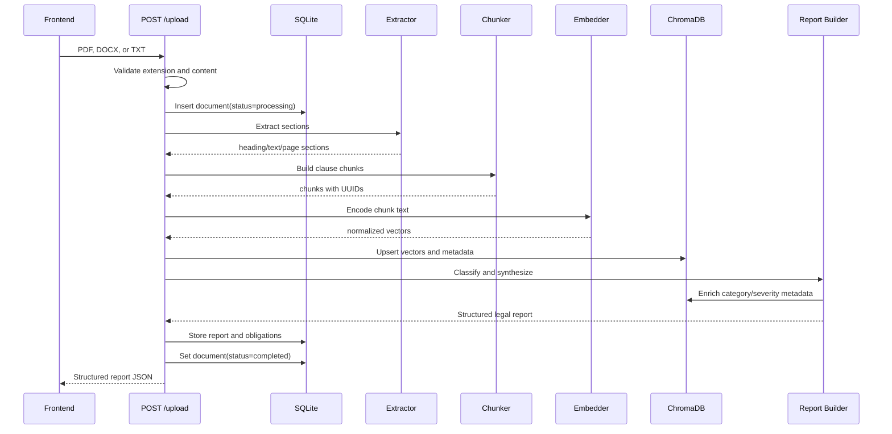
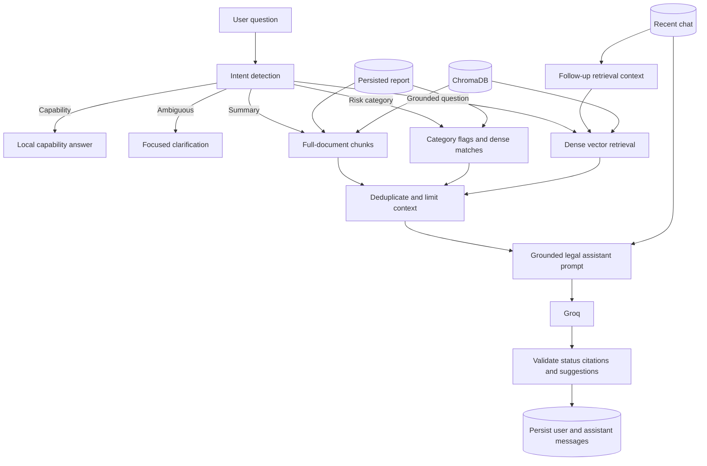

# ClauseGuard Backend

ClauseGuard is a local-first legal-document analysis API built with FastAPI. It
accepts PDF, DOCX, and TXT contracts, extracts structured text, creates
overlapping semantic chunks, embeds those chunks, stores them in ChromaDB,
generates a citation-grounded legal-risk report, and supports persistent
document chat, obligations, clause comparison, and PDF/DOCX exports.

The system is designed for a single-user workspace. SQLite, uploaded files, and
ChromaDB are stored locally under `backend/data`, so a production deployment
must provide persistent filesystem storage.

> ClauseGuard provides AI-assisted document review, not legal advice. Generated
> findings must be checked against the cited source language.

## Contents

- [System architecture](#system-architecture)
- [Repository layout](#repository-layout)
- [Installation and configuration](#installation-and-configuration)
- [Runtime storage and data model](#runtime-storage-and-data-model)
- [Document ingestion pipeline](#document-ingestion-pipeline)
- [Extraction](#1-extraction)
- [Chunking](#2-chunking)
- [Embeddings](#3-embeddings)
- [Vector database](#4-vector-database)
- [Risk classification and report synthesis](#5-risk-classification-and-report-synthesis)
- [RAG and persistent chat](#rag-and-persistent-chat)
- [Comparison, obligations, and exports](#comparison-obligations-and-exports)
- [API reference](#api-reference)
- [Migrations and legacy data](#migrations-and-legacy-data)
- [Testing](#testing)
- [Operations, security, and limitations](#operations-security-and-limitations)

## System architecture



The backend uses a layered service architecture:

1. **API layer** validates requests and coordinates services.
2. **Extraction and ML services** transform documents into searchable,
   classified clauses.
3. **SQLite** stores workspace metadata, reports, obligations, and chat.
4. **ChromaDB** stores chunk text, metadata, and embedding vectors.
5. **Groq**, through its OpenAI-compatible API, performs classification,
   report synthesis, grounded question answering, and comparison explanations.
6. Deterministic and local-model fallbacks preserve partial functionality when
   an LLM request fails.

## Repository layout

```text
backend/
├── alembic/
│   ├── env.py
│   └── versions/001_workspace.py
├── app/
│   ├── main.py                    # FastAPI startup, CORS, health endpoint
│   ├── api/
│   │   ├── dependencies.py        # Request-scoped SQLAlchemy session
│   │   └── routes.py              # Workspace and analysis endpoints
│   ├── db/
│   │   ├── models.py              # Document, report, chat, obligation models
│   │   └── session.py             # SQLite engine, paths, schema bootstrap
│   ├── domain/
│   │   └── playbooks.py           # Deterministic negotiation defaults
│   ├── schemas/
│   │   ├── api.py                 # Public request/response contracts
│   │   └── document.py            # Internal Section and Chunk contracts
│   └── services/
│       ├── extractor.py           # PDF, DOCX, TXT extraction and OCR
│       ├── chunker.py             # Sentence-aware overlapping chunks
│       ├── embedder.py            # SentenceTransformer embeddings
│       ├── vector_db.py           # Chroma persistence and retrieval
│       ├── classifier.py          # Local classification fallback
│       ├── report_builder.py      # Classification and structured synthesis
│       ├── chat_store.py          # Persistent bounded conversation history
│       ├── rag.py                 # Intent routing and grounded answers
│       ├── compare.py             # Cross-document clause alignment
│       └── exporter.py            # PDF and DOCX report generation
├── data/                          # Generated runtime data; Git-ignored
│   ├── reports.db                 # SQLite workspace
│   ├── uploads/                   # Original uploaded files
│   └── chroma_db/                 # Chroma collection files
├── models/                        # Optional fine-tuned classifier
├── scripts/                       # Dataset and model utilities
├── tests/                         # Pytest suite and integration scripts
├── alembic.ini
├── requirements.txt
└── .env.example
```

## Installation and configuration

### Prerequisites

- Python 3.9 or newer; Python 3.11 is recommended for deployment.
- `pip` and `venv`.
- Tesseract OCR if scanned PDFs must be supported.
- A Groq API key for LLM-generated classification, reports, comparisons, and
  document answers.
- Enough memory for `sentence-transformers`, Transformers, and ChromaDB.

Install Tesseract on macOS:

```bash
brew install tesseract
```

Install it on Ubuntu/Debian:

```bash
sudo apt update
sudo apt install -y tesseract-ocr
```

### Local setup

```bash
cd backend
python3 -m venv venv
source venv/bin/activate
pip install -r requirements.txt
cp .env.example .env
```

Windows activation:

```powershell
venv\Scripts\activate
```

The project pins `numpy<2.0.0` for compatibility with the installed ML and
ChromaDB stack.

### Environment variables

```env
# Required for complete AI behavior
GROQ_API_KEY=

# Comma-separated frontend origins accepted by CORS
FRONTEND_URLS=http://localhost:3000

# Chunking controls
CHUNK_MAX_WORDS=250
CHUNK_OVERLAP_WORDS=50
```

`GROQ_API_KEY` behavior:

- Report classification falls back to a local classifier if the key is absent
  or the LLM request fails.
- Structured report synthesis has deterministic fallbacks.
- Capability and clarification chat responses can be produced locally.
- Full generative document Q&A requires Groq. Without it, the RAG LLM call
  returns a configuration error.

`FRONTEND_URLS` accepts multiple comma-separated origins:

```env
FRONTEND_URLS=http://localhost:3000,https://clauseguard.example.com
```

### Start the API

Development:

```bash
uvicorn app.main:app --reload --port 8001
```

Production:

```bash
uvicorn app.main:app --host 0.0.0.0 --port "${PORT:-8001}"
```

Useful URLs:

- API: `http://localhost:8001`
- OpenAPI UI: `http://localhost:8001/docs`
- Alternative API docs: `http://localhost:8001/redoc`
- Health check: `http://localhost:8001/health`

At startup, `app/main.py`:

1. Loads `.env`.
2. Configures application logging.
3. Runs `bootstrap_schema()` to create or upgrade local tables.
4. Logs whether Groq is configured.
5. Registers the workspace router.

## Runtime storage and data model

All persistent data is rooted at `backend/data`:

```text
data/
├── reports.db
├── uploads/
└── chroma_db/
```

The directory is created automatically and excluded from Git.

### Relational model

```mermaid
erDiagram
    DOCUMENTS ||--|| REPORTS : has
    DOCUMENTS ||--o{ CHAT_MESSAGES : contains
    DOCUMENTS ||--o{ OBLIGATIONS : contains

    DOCUMENTS {
        string doc_id PK
        string filename
        string content_type
        string status
        text error
        string file_path
        int section_count
        int chunk_count
        int flag_count
        string overall_risk
        datetime created_at
        datetime updated_at
    }

    REPORTS {
        string doc_id PK_FK
        json report_json
        datetime created_at
        datetime updated_at
    }

    CHAT_MESSAGES {
        int id PK
        string doc_id FK
        string role
        text content
        json citations_json
        datetime created_at
    }

    OBLIGATIONS {
        int id PK
        string doc_id FK
        string party
        text action
        text trigger
        string deadline
        string period
        string recurrence
        text consequence
        float confidence
        string status
        json source_chunk_ids
        datetime created_at
        datetime updated_at
    }
```

Deleting a document cascades through its report, chat messages, and obligations.
The route also removes its Chroma vectors and original uploaded file.

### Document state

`DocumentModel.status` uses:

- `processing`: the upload pipeline has started.
- `completed`: the report and workspace data were persisted.
- `failed`: processing failed; `error` contains the failure message.

Upload processing is currently synchronous. Although the status endpoint can
represent processing state, `POST /upload` does not return until the pipeline
finishes or fails.

## Document ingestion pipeline

`POST /upload` accepts multipart form data with a `file` field.



The upload route performs these operations:

1. Accept only `.pdf`, `.docx`, and `.txt`.
2. Reject empty files.
3. Generate a UUID `doc_id`.
4. save the source file as `data/uploads/{doc_id}{extension}`.
5. Insert a processing document row.
6. Extract sections.
7. Create chunks.
8. Generate embeddings.
9. Store chunks in ChromaDB.
10. Classify clauses and synthesize the report.
11. Persist obligations and report JSON.
12. Update counts, risk, timestamps, and completion status.

If processing raises an exception, the document is marked `failed`, the error
is logged and persisted, and the endpoint responds with HTTP 500.

## 1. Extraction

Implementation: `app/services/extractor.py`

The extractor produces sections shaped like:

```json
{
  "section_id": "uuid",
  "heading": "Termination",
  "text": "Either party may terminate...",
  "page": 4
}
```

Shared extraction heuristics:

- Remove page numbers, signature lines, copyright notices, bare dates, table of
  contents labels, and other configured boilerplate.
- Detect numbered clauses such as `1.2 Term`.
- Detect `Article`, `Section`, `Schedule`, `Exhibit`, and similar markers.
- Detect short mostly-uppercase headings.
- Detect short colon-terminated headings.
- Match a built-in list of common legal headings.

### PDF

PDF extraction uses `pdfplumber`.

- Tables are serialized into readable `cell | cell` text and emitted as
  sections named `Table (Page N)`.
- Normal page text is split on blank lines.
- If extracted text is missing or shorter than 50 characters, the page is
  rendered at 300 DPI and passed to Tesseract OCR.
- PDF page numbers come directly from the source page index.

### DOCX

DOCX extraction uses `python-docx`.

- Paragraph styles beginning with `Heading` are treated as headings.
- XML page-break markers are detected where available.
- Page numbers are also estimated at approximately 3,000 characters per page.

DOCX page numbers are estimates because Word pagination depends on rendering
configuration not fully represented by the document XML.

### TXT

TXT extraction attempts:

1. UTF-8
2. Latin-1
3. UTF-8 with replacement characters

Blocks are split on blank lines. Page numbers are estimated at approximately
3,000 characters per page.

## 2. Chunking

Implementation: `app/services/chunker.py`

The internal chunk shape is:

```json
{
  "chunk_id": "uuid",
  "doc_id": "document-uuid",
  "text": "Clause text...",
  "page": 4,
  "heading": "Termination"
}
```

Chunking defaults:

- Maximum: `250` words
- Overlap: `50` words
- Tokenizer: NLTK `punkt_tab`

Each extracted section is treated as an atomic unit:

1. Sections at or below `CHUNK_MAX_WORDS` become one chunk.
2. Longer sections are tokenized into sentences.
3. Sentences are accumulated until the next sentence would exceed the maximum.
4. The current chunk is emitted.
5. Its final `CHUNK_OVERLAP_WORDS` words are carried into the next chunk.

The splitter avoids breaking before legal continuation phrases including:

- `provided that`
- `notwithstanding`
- `subject to`
- `except as`
- `without limiting`
- `for the avoidance of doubt`
- `including without limitation`

Overlap provides local context across boundaries while sentence-aware splitting
reduces mid-clause fragmentation.

## 3. Embeddings

Implementation: `app/services/embedder.py`

ClauseGuard uses:

- Model: `sentence-transformers/all-MiniLM-L6-v2`
- Batch size: `64`
- Normalization: enabled

The model is loaded once at module import. `embed_chunks()` encodes chunk text in
batches and adds a list-valued `vector` field. `embed_text()` uses the same
model and normalization for user questions and comparison operations.

Normalized vectors allow cosine similarity to compare direction without being
affected by vector magnitude. The same model must be used for indexing and
querying; replacing it requires rebuilding stored embeddings.

Operational consequence: the first process start may download the model and
requires substantially more memory than a minimal FastAPI application.

## 4. Vector database

Implementation: `app/services/vector_db.py`

Chroma configuration:

- Persistent path: `backend/data/chroma_db`
- Collection: `clauseguard_chunks`
- Distance space: cosine
- Client: module-level singleton in normal operation

Each record contains:

- ID: `chunk_id`
- Document: original chunk text
- Embedding: normalized MiniLM vector
- Metadata: `doc_id`, `page`, `heading`
- Enriched metadata after analysis: `category`, `severity`

### Storage

`store_chunks()` skips chunks without vectors and upserts all valid records. An
upsert makes reprocessing by the same chunk ID idempotent.

### Retrieval

`query_similar()` supports:

- Single-document filtering with `doc_id`.
- Multi-document filtering with `doc_ids`.
- Default `top_k=8`.
- Optional per-document quotas for balanced multi-document retrieval.
- Similarity conversion using `1 - cosine_distance`.

`get_chunks_by_doc()` retrieves text and metadata without embeddings to reduce
memory use. It is used for full-document summaries and comparisons.

### Metadata enrichment and deletion

`update_chunk_metadata()` merges classification metadata into an existing
record and keeps only Chroma-compatible scalar values.

`delete_document()` counts and deletes all records matching a `doc_id`.

## 5. Risk classification and report synthesis

Implementation:

- `app/services/report_builder.py`
- `app/services/classifier.py`
- `app/domain/playbooks.py`

### Classification

Chunks are classified in batches of at most 25. With Groq configured, the
OpenAI-compatible client calls:

```text
Base URL: https://api.groq.com/openai/v1
Model: llama-3.3-70b-versatile
Temperature: 0.1
Response: JSON
```

The model returns a category, severity, and short plain-English explanation for
every clause.

Supported categories:

- `auto_renewal`
- `liability`
- `arbitration`
- `data_sharing`
- `termination`
- `penalty`
- `indemnification`
- `intellectual_property`
- `confidentiality`
- `non_compete`
- `payment_terms`
- `force_majeure`
- `none`

Severity is one of `high`, `medium`, or `low`. A `none` category is normalized
to low severity and omitted from flags.

LLM output is validated before use:

- Unknown categories become `none`.
- Unknown severities become `medium`.
- Missing results fall back to safe defaults.
- Only flagged categories are included in the legal report.

### Local classification fallback

If Groq is unavailable or returns malformed output, `classifier.py` is used:

1. If `backend/models/clause_classifier` exists, load the fine-tuned text
   classifier.
2. Otherwise load `facebook/bart-large-mnli` for zero-shot classification.
3. Zero-shot classifications below confidence `0.45` become `none`.
4. Severity is derived from category defaults and risk keywords.

The local fallback classifies clauses but cannot provide the same quality of
generated explanations as the LLM path.

### Structured synthesis

After clause classification, a separate synthesis pass receives up to 20
normalized flags. Keeping synthesis separate from classification controls
context size and allows independent validation.

The report contains:

```json
{
  "doc_id": "uuid",
  "executive_summary": "...",
  "overall_risk": "high",
  "review_priorities": [],
  "obligations": [],
  "negotiation_playbook": [],
  "flags": [],
  "suggested_questions": [],
  "analyzed_at": "ISO-8601 timestamp",
  "model": "llama-3.3-70b-versatile",
  "disclaimer": "AI-assisted legal review..."
}
```

Citation integrity is enforced during synthesis:

- Every priority and obligation must provide `source_chunk_ids`.
- IDs not present among the document's flags are removed.
- Generated items with no valid source IDs are rejected.
- Severity and other enum-like fields are normalized.

### Deterministic synthesis fallback

If no LLM is available, deterministic functions produce:

- Overall risk from the highest flag severity.
- Up to five review priorities.
- Up to eight obligations from relevant categories.
- Up to five document-specific suggested questions.

### Negotiation playbook

`domain/playbooks.py` stores deterministic defaults by legal-risk category. The
report selects one playbook item per unique category, up to six. Every item
includes:

- Primary ask
- Fallback position
- Rationale
- Suggested contract language
- Severity
- Source chunk IDs

## RAG and persistent chat

Implementation:

- `app/services/rag.py`
- `app/services/chat_store.py`

RAG means Retrieval-Augmented Generation: the system retrieves document
evidence first and asks the LLM to answer from that evidence rather than from
unrestricted model memory.



### Intent routing

Before vector retrieval, deterministic routing identifies:

- `capability`: questions such as “How can you help?”
- `document_summary`: requests for summaries or overviews.
- `risk_analysis`: questions matching known legal categories.
- `clarification`: short ambiguous questions such as “Is this legit?”
- `grounded_answer`: other document questions.

This prevents broad requests from being rejected only because they have weak
embedding similarity.

### Retrieval strategy

Constants:

- Dense retrieval `TOP_K=8`
- Maximum prompt evidence: 28,000 characters
- LLM retries: 3
- Persistent history window: up to five question/answer pairs

Dense retrieval:

1. Encode the question with MiniLM.
2. Search Chroma within the requested document scope.
3. Prefer results with similarity at least `0.18`.
4. If no result reaches that score, keep the top four rather than returning a
   static refusal.
5. Use at most five dense chunks in the normal answer path.

Intent-specific evidence:

- **Summary:** up to 18 full-document chunks, report flags, and dense matches.
- **Risk analysis:** matching report categories, dense matches, and leading
  report flags.
- **Grounded answer:** dense matches plus a limited report fallback.
- **Multi-document request:** balanced retrieval with per-document quotas.

For short follow-up questions, recent history is appended to the retrieval
query so phrases such as “What about the notice period?” preserve context from
the previous turn.

### Report fallback

The persisted report is an additional evidence source. It allows legacy
documents or documents with incomplete vectors to answer category and summary
questions from previously validated flags.

If summary evidence is unavailable but an executive summary exists, it is
returned directly. If no document evidence is available, the assistant returns
an explicit `not_found` response and suggests topics that are present.

### Prompt and response safety

The RAG prompt instructs the model to:

- Use only supplied analysis and clauses for document-specific facts.
- Distinguish summaries, risks, actions, and unsupported requests.
- Ask a focused question for ambiguous input.
- Avoid inventing terms absent from the document.
- Cite only provided chunk IDs.
- Keep raw chunk IDs out of prose.
- Provide useful follow-up questions grounded in available topics.

The response includes:

```json
{
  "status": "answered",
  "answer_type": "risk_analysis",
  "answer": "Plain-English response...",
  "citations": [
    {"chunk_id": "uuid", "page": 4}
  ],
  "follow_ups": [
    "What should I negotiate in this clause?"
  ],
  "message_id": 42
}
```

Statuses:

- `answered`
- `not_found`
- `needs_clarification`

Answer types:

- `document_summary`
- `risk_analysis`
- `grounded_answer`
- `clarification`
- `capability`

Citation validation removes every ID that is not present in the evidence
provided to the model. A final text-cleaning pass removes raw chunk-ID labels
from answer prose.

### Persistent conversation

Every `/ask` request stores:

1. The user message.
2. The assistant message.
3. Validated citations attached to the assistant message.

`GET /chat/{doc_id}` returns messages chronologically. Prompt history is bounded
so conversations remain useful without growing the LLM context indefinitely.

## Comparison, obligations, and exports

### Cross-document comparison

Implementation: `app/services/compare.py`

The current comparison service compares the first two requested documents:

1. Load both cached reports.
2. Optionally prefilter flags by category.
3. Embed each flagged clause.
4. Greedily align each left-side clause to the best unused right-side clause.
5. Add a small similarity bonus when categories match.
6. Keep matches at or above `0.55`.
7. Return at most 12 aligned pairs.
8. Ask Groq for a concise material-difference explanation.

If Groq is unavailable, a deterministic difference description based on
category and severity is returned.

### Obligations

Obligations are extracted during report synthesis and stored as relational
rows. Supported states:

- `unconfirmed`
- `confirmed`
- `completed`
- `dismissed`

Relative periods such as “within 30 days” remain in `period`; they are not
presented as calendar dates unless the source provides an absolute date.

Updating an obligation changes only its status. Reprocessing or legacy report
upgrade may recreate obligation rows from report data.

### Exports

Implementation: `app/services/exporter.py`

Exports are generated in memory:

- PDF through ReportLab.
- DOCX through `python-docx`.

Both formats include the executive summary, risk, priorities, obligations,
negotiation playbook, flagged clauses, citations/source details, provenance,
and legal disclaimer.

## API reference

All endpoints have no URL prefix.

### `GET /health`

Returns API status, version, and whether an LLM key is configured.

```json
{
  "status": "ok",
  "version": "0.3.0",
  "llm_configured": true
}
```

### `POST /upload`

Multipart fields:

```text
file: PDF, DOCX, or TXT
```

Returns the complete structured report. Processing is synchronous.

Errors:

- `400`: unsupported extension or empty file.
- `500`: extraction, embedding, analysis, or persistence failure.

### `GET /documents`

Returns all document summaries, newest first.

### `GET /documents/{doc_id}`

Returns document metadata and its normalized structured report.

### `GET /status/{doc_id}`

Returns processing state, filename, error, and flag count.

### `GET /report/{doc_id}`

Returns a normalized structured report. A legacy flag-only report is upgraded
in place with deterministic/LLM synthesis and persisted obligations.

### `GET /chat/{doc_id}`

Returns chronological persistent chat messages and citations.

### `POST /ask`

Request:

```json
{
  "doc_id": "primary-document-uuid",
  "question": "What is the termination risk?",
  "doc_ids": null
}
```

`doc_ids` is optional and supports retrieval across a document scope.

Response:

```json
{
  "status": "answered",
  "answer_type": "risk_analysis",
  "answer": "The agreement permits...",
  "citations": [
    {"chunk_id": "uuid", "page": 4}
  ],
  "message_id": 42,
  "follow_ups": [
    "What notice period applies?"
  ]
}
```

### `PATCH /obligations/{obligation_id}`

Request:

```json
{
  "status": "confirmed"
}
```

Returns the updated obligation.

### `POST /compare`

Request:

```json
{
  "doc_ids": ["left-uuid", "right-uuid"],
  "categories": ["termination", "liability"]
}
```

At least two IDs are required. The current service compares the first two.

### `GET /export/{doc_id}?format=pdf`

Supported formats:

- `pdf`
- `docx`

Returns a binary attachment.

### `DELETE /document/{doc_id}`

Deletes:

- Document metadata.
- Cached report.
- Obligations.
- Chat messages.
- Uploaded source file.
- Chroma vectors.

## Migrations and legacy data

ClauseGuard supports two schema mechanisms.

### Startup bootstrap

`bootstrap_schema()` runs on every startup:

1. Create missing SQLAlchemy tables.
2. Add missing report timestamp columns.
3. Backfill document rows for legacy report-only records.

Legacy records receive the filename `Legacy document` because the historical
schema did not preserve filenames.

### Alembic

For explicit migration workflows:

```bash
alembic upgrade head
```

Configuration:

- `alembic.ini`
- `alembic/env.py`
- `alembic/versions/001_workspace.py`

Back up `data/reports.db` before manually applying or modifying migrations.

## Testing

Run the backend tests from `backend`:

```bash
source venv/bin/activate
PYTHONPATH=. pytest tests/ -q
```

Focused checks:

```bash
PYTHONPATH=. pytest tests/test_workspace.py -q
PYTHONPATH=. pytest tests/test_vector_store.py -q
PYTHONPATH=. pytest tests/test_report.py -q
PYTHONPATH=. pytest tests/test_api.py -q
```

Test coverage includes:

- Extraction for supported formats.
- Chunk creation.
- Chroma document isolation.
- Risk ordering and report fallback.
- Assistant intent routing and suggestions.
- Negotiation defaults.
- PDF and DOCX exports.
- API upload, report, chat, and export flows.

LLM calls should be mocked in automated tests to keep them deterministic.
`tests/test_rag.py` is also usable as a manual integration script when a Groq
key is configured.

## Operations, security, and limitations

### Deployment requirements

The current architecture requires:

- A persistent filesystem for `data/reports.db`, `data/uploads`, and
  `data/chroma_db`.
- A single application instance.
- Enough memory for SentenceTransformer and optional fallback classifiers.
- Network access for initial Hugging Face model downloads and Groq requests.
- Tesseract installed at the operating-system level for scanned PDFs.

Do not run multiple replicas against the same local SQLite and Chroma files.
For horizontal scaling, migrate to shared PostgreSQL/object storage and a
network-accessible vector database.

### Current limitations

- Upload processing is synchronous and may exceed short platform timeouts.
- The comparison endpoint accepts multiple IDs but currently compares only the
  first two.
- SQLite is intended for a single process or low-concurrency workspace.
- Full generated RAG answers require Groq.
- OCR quality depends on scan resolution and Tesseract language support.
- DOCX and TXT page numbers are estimates.
- The embedding model loads during module import, increasing cold-start time.
- There is no background job queue.
- There is no authentication or per-user ownership model.

### Security

The API currently has no authentication. Do not expose it publicly with
sensitive legal documents without adding:

- Authentication and authorization.
- Per-user document ownership.
- Upload size limits.
- MIME/content validation in addition to extension checks.
- Rate limiting and request quotas.
- Encryption and retention policies.
- Secret management for `GROQ_API_KEY`.
- Restricted CORS origins.
- Audit logging and secure deletion requirements.

Never commit `.env`, uploaded documents, SQLite databases, Chroma data, or
model caches. These paths are excluded by the repository `.gitignore`.
